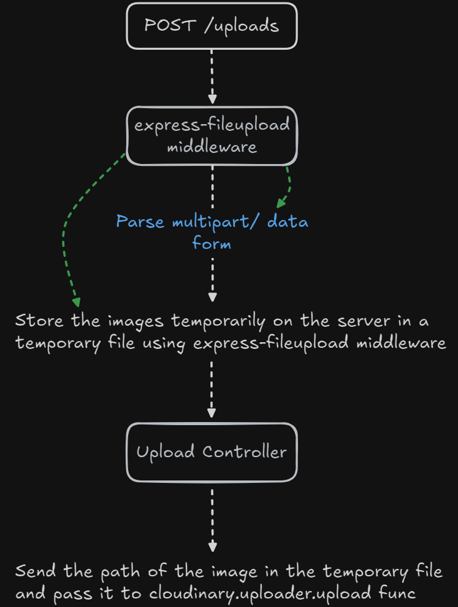

# Simple Express App with Cloudinary

This is a simple Express application that demonstrates how to upload images to Cloudinary and manage products with basic API endpoints.

## To illustrate how image uploads work with Cloudinary



When uploading images to Cloudinary in our Express application, we use the express-fileupload middleware to handle file uploads. This middleware parses the incoming files and makes them accessible via the req.files object. Once the files are parsed, we can then proceed to upload them to Cloudinary using the Cloudinary API.

Here's the process in detail:

1. **File Handling with `express-fileupload`:** First, we use `express-fileupload` to parse the uploaded files. This middleware makes the files available through `req.files`, allowing us to work with them easily.

2. **Temporary File Storage:** After parsing the file, we store it as a temporary file on the server. This is necessary because Cloudinary's upload function requires a file path, and storing the file temporarily allows us to provide this path.

3. **Uploading to Cloudinary:** We pass the path of the temporary file to Cloudinary's upload function. Cloudinary uses this path to upload the file to its servers.

4. **Cleaning Up:** Once the upload is complete, we delete the temporary file to avoid unnecessary storage usage on the server.

## Features

-   **GET /api/v1/products**: Retrieve a list of products.
-   **POST /api/v1/products**: Add a new product.
-   **POST /uploads**: Upload images to Cloudinary.

## Prerequisites

-   Node.js and npm installed on your machine.
-   A Cloudinary account with your API credentials.

## Setup

1. Clone the repository:

    ```bash
    git clone https://github.com/amrrdev/file-upload.git
    cd file-upload
    ```

2. Install dependencies:

    ```bash
    npm install
    ```

3. Configure Cloudinary:

    Create a `.env` file in the root directory and add your Cloudinary credentials:

    ```plaintext
    CLOUDINARY_CLOUD_NAME=your-cloud-name
    CLOUDINARY_API_KEY=your-api-key
    CLOUDINARY_API_SECRET=your-api-secret
    ```

4. Run the application:

    ```bash
    node app.js
    ```

## Endpoints

Here are the available API endpoints:

### GET /api/v1/products

Retrieve a list of products.

### POST /api/v1/products

Add a new product. The request should include the product name and image URL in JSON format.

### POST /uploads

Upload an image to Cloudinary using multipart/form-data.
